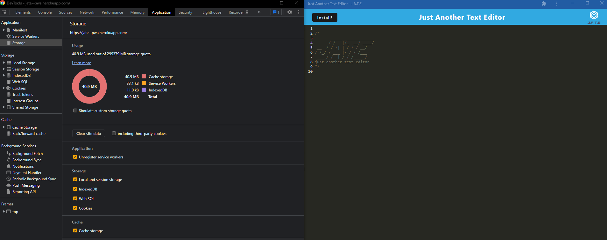

# PWA Text Editor

## Description

This is a progressive web application that is used as a text editor. I made this to further my knowledge on PWA's and how to use all the different dependencies that are needed to create one.

## Installation

Install the PWA using the install button on the webpage or in the browser's address bar.

To use the app locally, clone the repository to your local machine. Once cloned do the following to install the dependencies, build the app and run the local server.

    npm i
    npm run start

## Usage

Link to the deployed application [here](https://jate--pwa.herokuapp.com/)

## Credits

Starter Code: https://github.com/coding-boot-camp/cautious-meme

## License

See license [here](./LICENSE)
